# PRÁCTICA 4

## ENTORNOS DE DESARROLLO

## Carlos Herrera Martín y Rafael Ivorra Llodrá

## 1er curso de DAW

## Curso 2021/2022

<div style="page-break-after: always"></div>

Para esta práctica partimos de la creación de una cuenta personal en la web de GitHub, desde donde realizaremos las tareas que se nos indican. Como prerrequisito para poder trabajar en local desde un emulador de terminal, hemos generado un *token* que nos permite la autentificación para poder conectarnos remotamente a GitHub.

El primer paso para poder subir nuestro código a un repositorio en GitHub será, obviamente, crear dicho repositorio. Lo hacemos desde la interfaz web, vía el navegador:
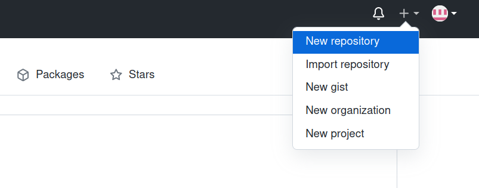

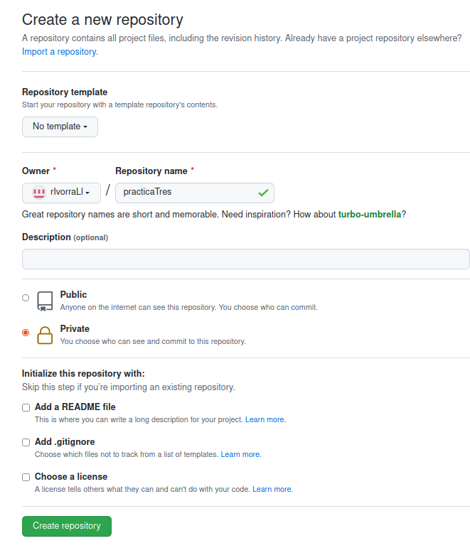

A continuación podemos ya abrir el emulador de terminal, donde hemos preparado unos directorios *ad hoc* donde hemos situado copias de los archivos Java utilizados para la actividad anterior. Iniciamos el repositorio local con la  orden

```bash
git init <directorio>
```

Y ya si navegamos al interior del directorio, veremos que, junto a los archivos que habíamos añadido de antemano, ha aparecido un directorio oculto ``` .git ```, que contendrá la estructura interna de datos necesaria para el control de versiones.

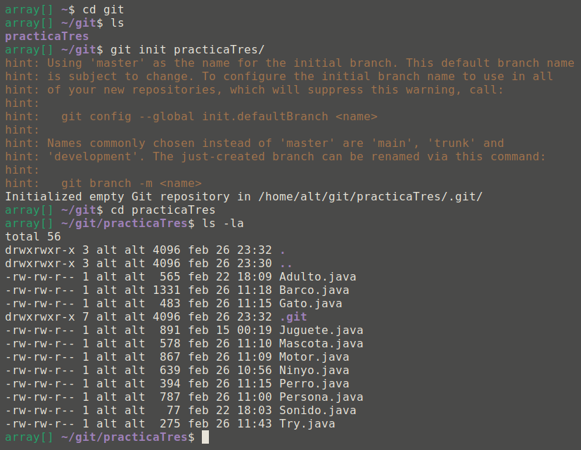

A continuación, añadimos todos los archivos y creamos un  ```commit``` inicial:

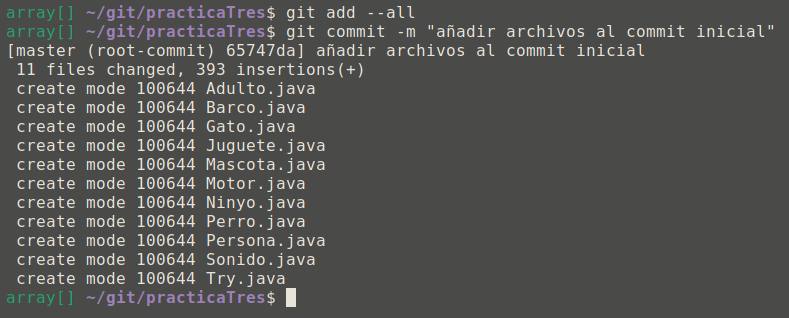

Incluimos también un archivo ```README.md``` y creamos un nuevo ```commit```. Dicho archivo suele contener información general sobre el proyecto alojado en el repositorio, y viene a ser la puerta de entrada de cualquiera que consulte sobre nuestro proyecto. Y ya podemos añadir los archivos a nuestro repositorio, directamente a la rama principal (*main*):

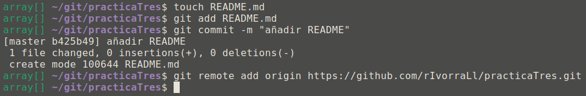

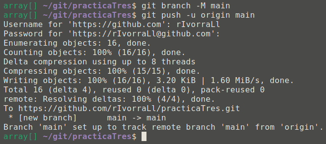

Podemos comprobar desde la interfaz web que, efectivamente, los archivos de nuestro directorio local están alojados ya en el repositorio remoto que habíamos creado en GitHub, donde además se nos indica que pertenecen a la rama *main*.

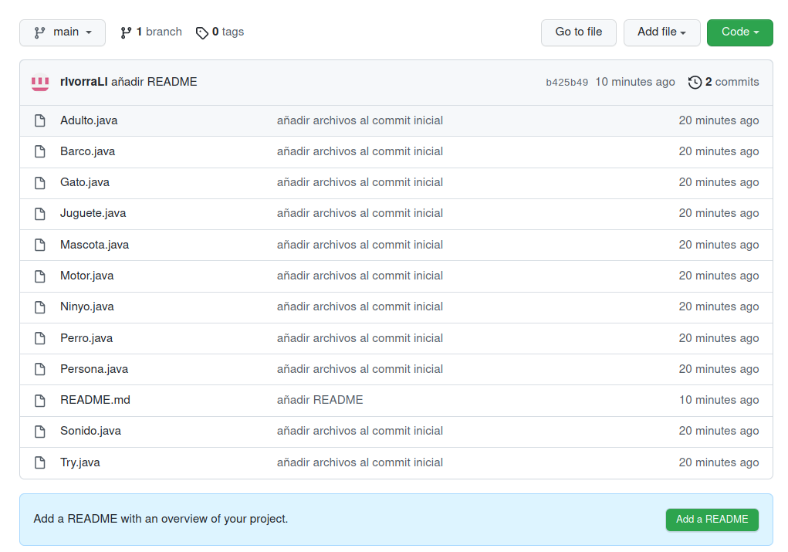

A continuación vamos a crear una nueva rama (*testing*) donde alojaremos los cambios en nuestro código. En una situación "real" de desarrollo la creación de ramas nos permitirá tener código en diferentes estados de evolución e incluso con funcionalidades "de prueba", no maduras aún para la versión de producción, y que quizá podrían no llegar a implementarse, para ir testeando distintas modificaciones en el mismo, proponer y aprobar cambios, etc.

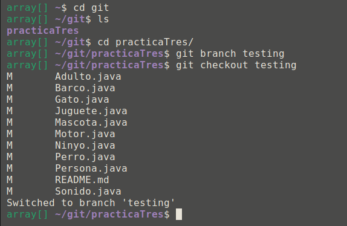

Aprovechamos para añadir la clase ```Principal.java``` que había quedado fuera en el ```commit``` anterior:

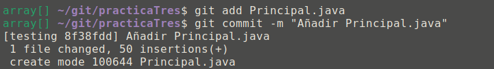

Y ya podemos "impulsar" (```push```) los cambios hacia nuestro repositorio, ahora desde la rama "*testing*" recién creada:

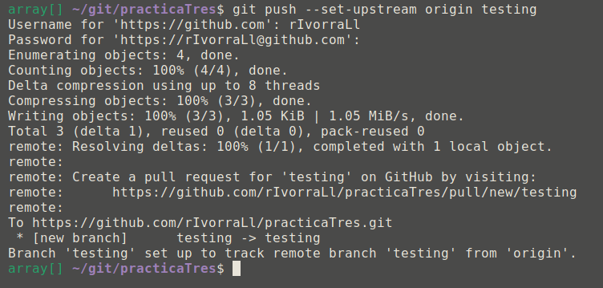

Si volvemos a la interfaz web, vemos cómo en efecto se ha creado una nueva rama:
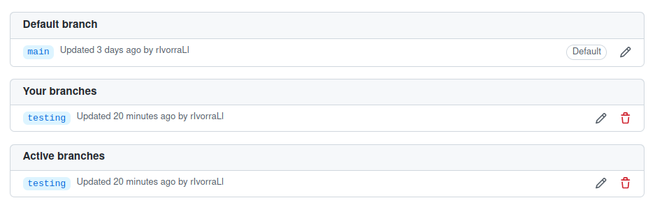

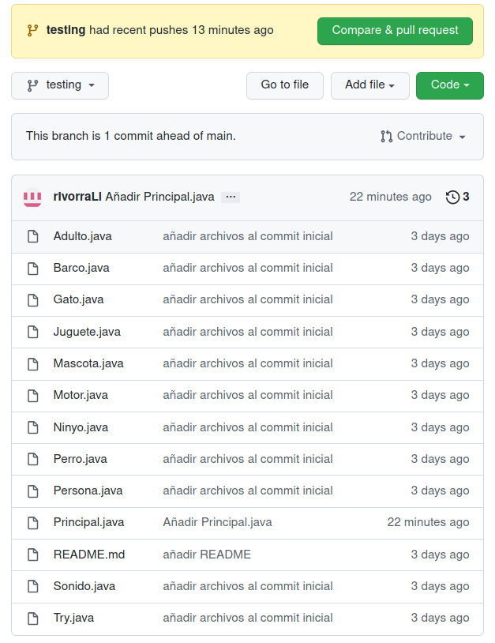

A continuación pasamos a crear un nuevo ```commit``` para probar tanto la rama *testing* recién creada, como añadir *tags* o etiquetas. Y hacemos un ```push``` para subir los cambios:

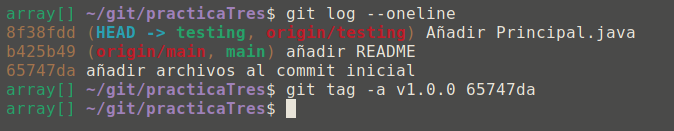

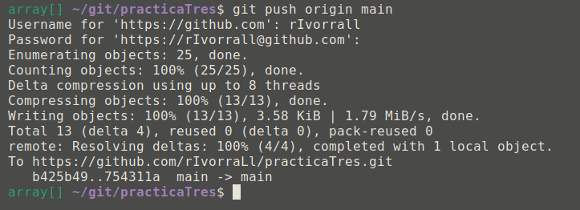

Podemos comprobar cómo aparecen los *tags* en nuestro repositorio remoto:

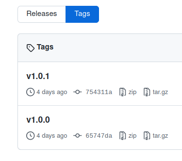

Ahora comenzaremos a alterar el código en sí, vía sucesivas refactorizaciones. Trabajaremos primero desde la rama *testing* y, si no surgen problemas, pasaremos a elevar los cambios a la rama principal.

Desde nuestro IDE modificamos el código en la rama de desarrollo, en este caso renombramos la clase *Mascota* a *Animal* modificando el nombre de sus métodos así como en las demás clases en que se le haga referencia.
Una vez modificado si utilizamos el comando ```git status``` git nos avisará de que se han realizado cambios en el código mostrando los archivos modificados en color rojo.
Lo siguiente que debemos hacer es un ```add``` y un ```commit``` que podemos realizar a la vez mediante el comando ```git commit -am "<Comentario>"```.
A continuación añadiremos un comentario en la clase *Gato* en la rama de desarrollo y repetiremos el mismo procedimiento que en la modificación anterior.

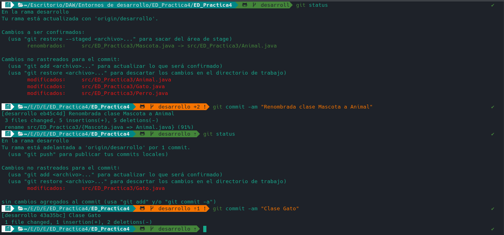

Lo siguiente que debemos hacer es implementar las modificaciones que hemos hecho en desarrollo a la rama *main*.
Para ello deberemos de cambiar de rama mediante el comando ```git checkout main``` y después implementaremos los cambios con el comando ```git merge desarrollo``` y añadiremos un *commit* para dejar constancia de los cambios.

El siguiente paso será actualizar la versión mediante el comando ```git tag v1.1.0``` y añadir la nueva versión a nuestros repositorio utilizando ```git push origin main``` y ```git push origin v1.1.0```.

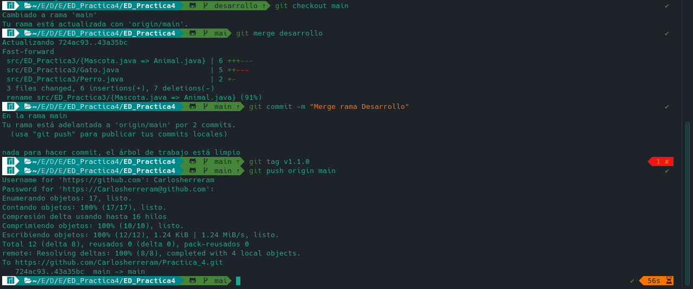

Para la próxima refactorización creamos una nueva rama a partir de la versión actual de la rama *main* con el comando ```git branch rama2``` cambiamos a esta rama utilizando ```git checkout rama2```, la subimos a github usando ```git push origin rama2``` y desde nuestro IDE eliminamos la interfaz *Sonido* y sus referencias en las clases en que se había implementado y añadimos algunos comentarios en la clase *Barco*.
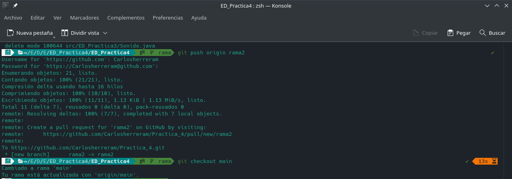

Ahora que hemos aplicado cambios estables en la rama *rama2* podemos fusionarla con la rama *main*. Así que utilizaremos el comando ```git merge rama2 -m "<<Comentario>>"``` para realizar la fusión y añadir un commit al mismo tiempo.
Una vez hecho el merge, subimos la rama principal a github uando ```git push origin main```.

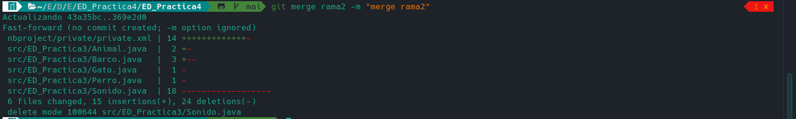

Ahora sólo faltaría añadir una etiqueta con la nueva versión del programa, usaremos de nuevo ```git tag v1.2.0``` y actualizaremos la versión en github con ```git push origin v1.2.0```.

Este es el aspecto de nuestro repositorio actualmente:
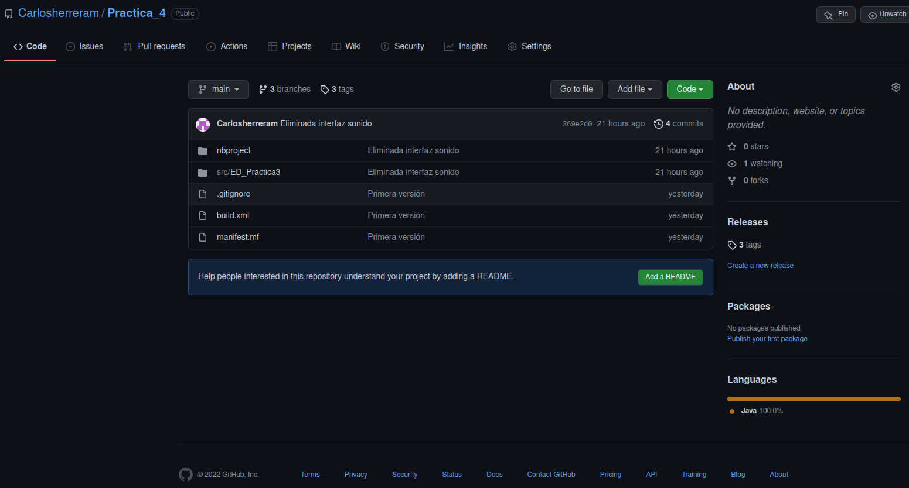

Si desde nuestro terminal utilizamos ```git checkout origin/main``` podemos trabajar directamente desde la rama *main* de github.
Mediante el comando ```git log --graph``` podemos consultar los diferentes commits de nuestro repositorio que se vería como la siguiente imágen:

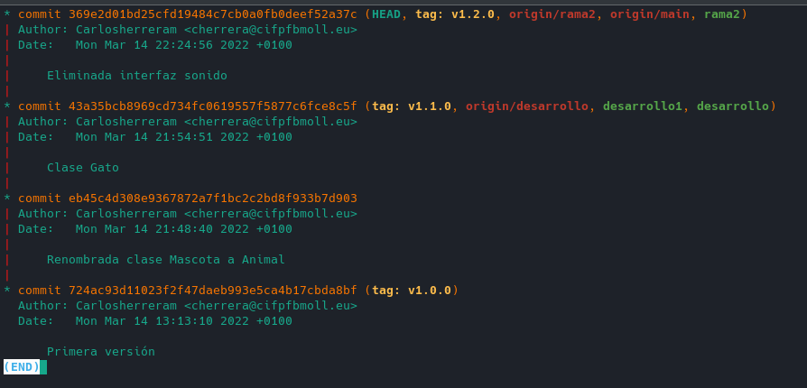


